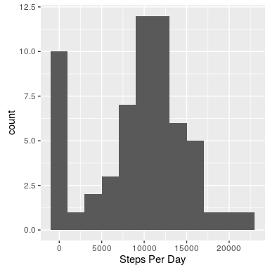

# Reproducible Research: Peer Assessment 1


```r
knitr::opts_chunk$set(results="hide", message = FALSE, fig.height=4, fig.width=4 )
```

First, we load the data, and renumber the intervals to indicate the minute
of the day at which the 5-minute interval began. Recall that there are 1440 = 24 x 60
minutes in a day.


```r
require(dplyr)

activity <- read.csv( unz("activity.zip","activity.csv") ) %>%
            mutate(interval = floor(interval/100)*60 + (interval %% 100) )
```

(1) What is the mean total number of steps taken per day?
Let's make a histogram of steps per day:


```r
require(ggplot2)

activityByDate <- activity %>% 
    group_by(date) %>%
    summarise(totalsteps=sum(steps,na.rm=TRUE))

activityByDate %>%
    ggplot(aes(x=totalsteps)) + 
    geom_histogram(binwidth = 2000) +
    labs(x="Steps Per Day")
```

<!-- -->

The mean number of steps per day is
9354.23 and the median is 
10395.00.
The data appears skewed by a large number of days with few steps.


(2) What is the average daily activity pattern?


```r
activityByInterval <- activity %>% 
                        group_by(interval) %>%
                        summarise(averageSteps=mean(steps,na.rm=TRUE))
activityByInterval %>%
    ggplot(aes(x=interval,y=averageSteps)) + 
    geom_line()
```

<!-- -->

```r
    labs(x="Interval #",y="Average Number of Steps")
    
maxInterval <- which.max(activityByInterval$averageSteps)

maxHour <- floor(activityByInterval$interval[maxInterval]/60)
maxMinute <- activityByInterval$interval[maxInterval] %% 60
```

The maximum average number of steps occurs on the
104st interval,
which corresponds to 8:35 in the
morning.
This peak could correspond to the morning commute, a regular weekday morning walk,
or some other routine activity during the workweek.

(3) Note that there are 2304 missing values in the data set.
These may introduce bias into summaries of the data set. To remedy this, we impute the
data by setting the missing values to the average number of steps for the corresponding interval.


```r
ix <- is.na(activity$steps)
activityImputed <- activity
activityImputed$steps[ix] <- activityByInterval$averageSteps[activity$interval[ix]/5+1]
```

Lets look at a histogram of steps per day for the imputed data:


```r
activityInputedByDate <- activityImputed %>% 
    group_by(date) %>%
    summarise(totalsteps=sum(steps,na.rm=TRUE))

activityInputedByDate %>%
    ggplot(aes(x=totalsteps)) + 
    geom_histogram(binwidth = 2000) +
    labs(x="Steps Per Day")
```

<!-- -->

After imputing the data, the mean number of steps per day is
10766.19
, and the median number of steps per day is 
10766.19.
Recall that prior to imputing, the mean and median were 
9354.23 and
10395.00, respectively.
It appears that imputing the data, we have removed the bias introduced by 
days with significant missing data.

(4) Is there a difference in activity on weekends versus weekdays?


```r
getDayType <- function(date) {
    dayTypes = c("Weekday","Weekend")
    type <- dayTypes[(weekdays(date) %in% c("Saturday","Sunday"))+1]
    }

activityByInterval2 <- activityImputed %>% 
                        mutate(dayType=getDayType(as.Date(date))) %>%
                        group_by(interval,dayType) %>%
                        summarise(averageSteps=mean(steps,na.rm=TRUE))

activityByInterval2 %>%
    ggplot(aes(x=interval,y=averageSteps)) + 
    geom_line() + 
    facet_grid(dayType~.) +
    labs(x="Interval #",y="Average Number of Steps")
```

<!-- -->

It appears that there is more activity throughout the day on the weekends,
and that the weekday morning spike of activity seen on the weekdays is much 
less pronounced on the weekend.


